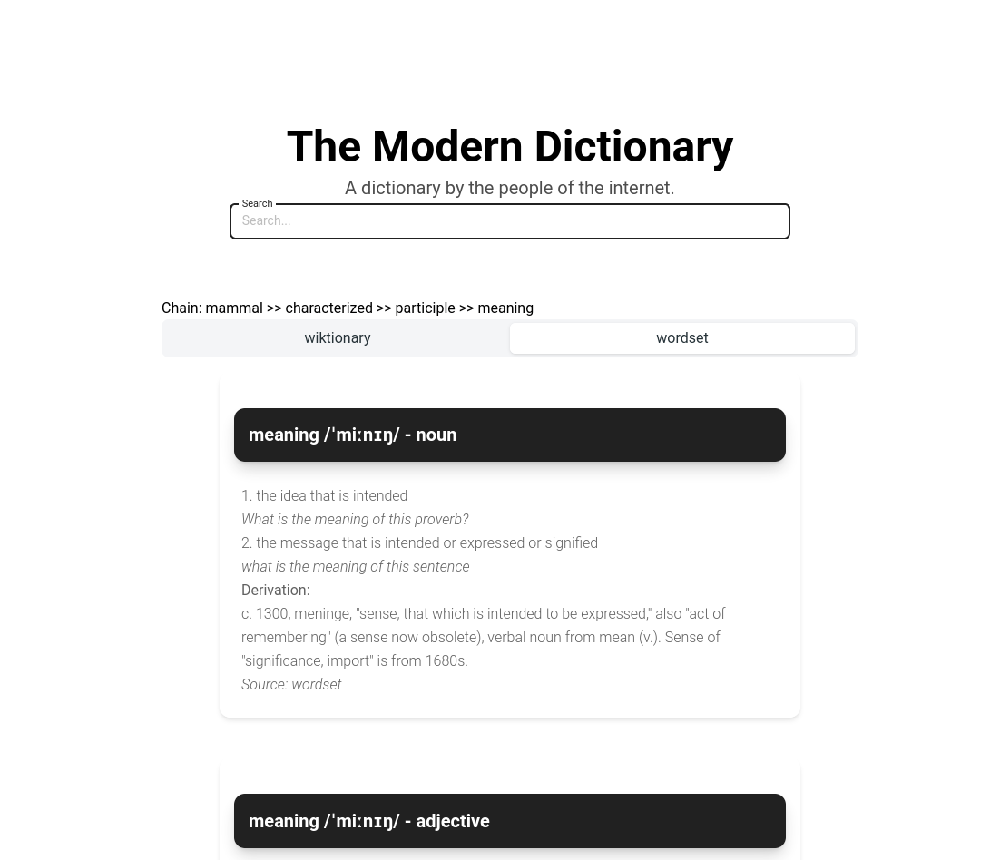
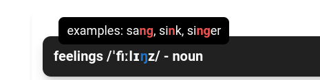

A dictionary app built on wiktionary and opensource dictionaries. 

Consists of a `frontend` in React and a simple python running an in memory duckdb database `backend`. Contains 1.5 million words and derivations.


## Scripts
Sources of data:

* Raw data download in json format from [wiktionary](kaikki.org)
* Opensource dictionary [wordset](github.com/wordset/wordset-dictionary)

The raw data files are over 20GB and after converting to parquet and duckdb the same data turns into a 222 mb  file.

Run `parse-wiki.py` to convert to parquest format. Run `parse-wordset.py` to convert to parquest format. Run`read-db.py` to read parquet files and insert into duckdb database.

## Dev

```
cd frontent
pnpm/yarn/npm run dev
```

```
cd backend
python ./backend/server.py
```

```
cd backend
python ./backend/server.py
```

## Production
It will download the database file upon running to keep the image small: 345MB
```
docker build -t dictionary:latest .
docker run -p 8000:8000 dictionary
```


 
